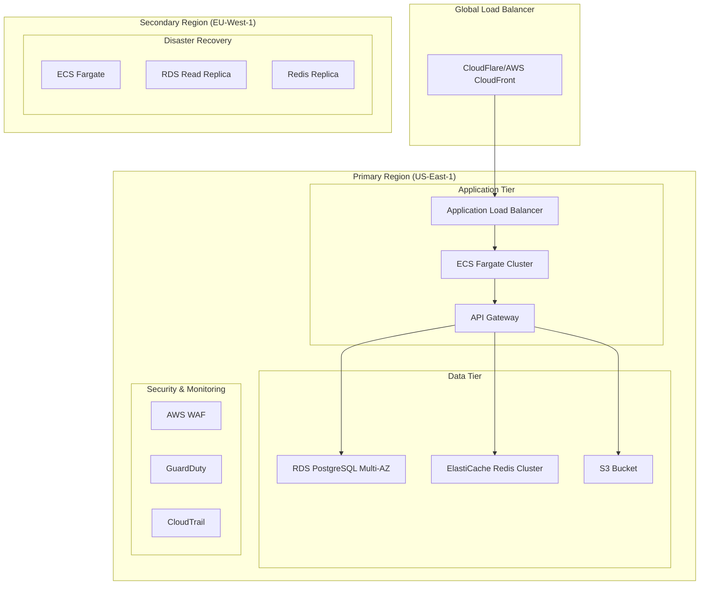
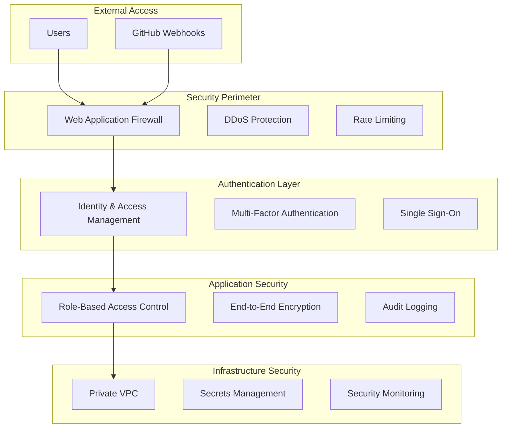

# Ignition GitHub App - Cloud Deployment Architecture

## Executive Summary

This document outlines the comprehensive cloud deployment architecture for the Ignition GitHub App, designed for enterprise-grade security, scalability, and compliance. The architecture supports multi-tenant SaaS deployment with global availability and regulatory compliance.

## Architecture Overview

### Deployment Strategy
- **Multi-Cloud Approach**: Primary AWS with Azure/GCP failover capabilities
- **Global Distribution**: Multi-region deployment for low latency
- **Auto-Scaling**: Horizontal and vertical scaling based on demand
- **High Availability**: 99.99% uptime SLA with disaster recovery
- **Security-First**: Zero-trust architecture with comprehensive monitoring

### Core Principles
1. **Scalability**: Handle 10,000+ organizations with millions of repositories
2. **Security**: Enterprise-grade security with compliance certifications
3. **Performance**: Sub-200ms response times globally
4. **Reliability**: 99.99% uptime with automated failover
5. **Compliance**: SOC 2, ISO 27001, GDPR, HIPAA ready

## Infrastructure Architecture

### High-Level Architecture


### Container Architecture
```dockerfile
# Production Dockerfile
FROM node:20-alpine AS builder
WORKDIR /app
COPY package*.json ./
RUN npm ci --only=production

FROM node:20-alpine AS runtime
RUN addgroup -g 1001 -S nodejs
RUN adduser -S nextjs -u 1001
WORKDIR /app
COPY --from=builder /app/node_modules ./node_modules
COPY --chown=nextjs:nodejs . .
USER nextjs
EXPOSE 3000
CMD ["npm", "start"]
```

### Kubernetes Deployment
```yaml
# k8s/deployment.yaml
apiVersion: apps/v1
kind: Deployment
metadata:
  name: ignition-app
  namespace: ignition-prod
spec:
  replicas: 3
  selector:
    matchLabels:
      app: ignition-app
  template:
    metadata:
      labels:
        app: ignition-app
    spec:
      containers:
      - name: ignition
        image: ignition:latest
        ports:
        - containerPort: 3000
        env:
        - name: DATABASE_URL
          valueFrom:
            secretKeyRef:
              name: ignition-secrets
              key: database-url
        - name: REDIS_URL
          valueFrom:
            secretKeyRef:
              name: ignition-secrets
              key: redis-url
        resources:
          requests:
            memory: "512Mi"
            cpu: "250m"
          limits:
            memory: "1Gi"
            cpu: "500m"
        livenessProbe:
          httpGet:
            path: /health
            port: 3000
          initialDelaySeconds: 30
          periodSeconds: 10
        readinessProbe:
          httpGet:
            path: /ready
            port: 3000
          initialDelaySeconds: 5
          periodSeconds: 5
```

## Security Architecture

### Zero-Trust Security Model


### Security Controls
```typescript
// Security Configuration
interface SecurityConfig {
  encryption: {
    atRest: 'AES-256';
    inTransit: 'TLS-1.3';
    keyRotation: '90-days';
  };
  authentication: {
    sessionTimeout: '1-hour';
    mfaRequired: true;
    passwordPolicy: 'NIST-800-63B';
  };
  access: {
    principleOfLeastPrivilege: true;
    roleBasedAccess: true;
    auditLogging: 'comprehensive';
  };
  monitoring: {
    realTimeAlerts: true;
    anomalyDetection: true;
    incidentResponse: 'automated';
  };
}
```

### Compliance Framework
- **SOC 2 Type II**: Security, availability, processing integrity
- **ISO 27001**: Information security management
- **GDPR**: Data privacy and protection
- **HIPAA**: Healthcare data security (when applicable)
- **FedRAMP**: Federal security requirements (future)

## Scalability & Performance

### Auto-Scaling Configuration
```yaml
# Horizontal Pod Autoscaler
apiVersion: autoscaling/v2
kind: HorizontalPodAutoscaler
metadata:
  name: ignition-hpa
spec:
  scaleTargetRef:
    apiVersion: apps/v1
    kind: Deployment
    name: ignition-app
  minReplicas: 3
  maxReplicas: 100
  metrics:
  - type: Resource
    resource:
      name: cpu
      target:
        type: Utilization
        averageUtilization: 70
  - type: Resource
    resource:
      name: memory
      target:
        type: Utilization
        averageUtilization: 80
```

### Database Scaling
```sql
-- Read Replica Configuration
CREATE REPLICA ignition_read_replica_1 
FROM ignition_primary 
WITH (
  REGION = 'us-west-2',
  INSTANCE_CLASS = 'db.r6g.xlarge',
  MULTI_AZ = true,
  BACKUP_RETENTION = 7
);

-- Partitioning Strategy
CREATE TABLE audit_logs (
    id UUID PRIMARY KEY,
    installation_id BIGINT,
    event_type VARCHAR(100),
    created_at TIMESTAMP,
    data JSONB
) PARTITION BY RANGE (created_at);

-- Monthly partitions
CREATE TABLE audit_logs_2024_01 PARTITION OF audit_logs
FOR VALUES FROM ('2024-01-01') TO ('2024-02-01');
```

### Caching Strategy
```typescript
// Multi-Layer Caching
class CacheManager {
  private redis: Redis;
  private memoryCache: LRU;
  
  async get(key: string): Promise<any> {
    // L1: Memory cache (fastest)
    let value = this.memoryCache.get(key);
    if (value) return value;
    
    // L2: Redis cache (fast)
    value = await this.redis.get(key);
    if (value) {
      this.memoryCache.set(key, value);
      return JSON.parse(value);
    }
    
    return null;
  }
  
  async set(key: string, value: any, ttl: number): Promise<void> {
    this.memoryCache.set(key, value, ttl);
    await this.redis.setex(key, ttl, JSON.stringify(value));
  }
}
```

## Monitoring & Observability

### Monitoring Stack
```yaml
# Prometheus Configuration
apiVersion: v1
kind: ConfigMap
metadata:
  name: prometheus-config
data:
  prometheus.yml: |
    global:
      scrape_interval: 15s
    scrape_configs:
    - job_name: 'ignition-app'
      kubernetes_sd_configs:
      - role: pod
      relabel_configs:
      - source_labels: [__meta_kubernetes_pod_label_app]
        action: keep
        regex: ignition-app
```

### Application Metrics
```typescript
// Custom Metrics
class MetricsCollector {
  private prometheus = require('prom-client');
  
  private httpRequestDuration = new this.prometheus.Histogram({
    name: 'http_request_duration_seconds',
    help: 'Duration of HTTP requests in seconds',
    labelNames: ['method', 'route', 'status_code']
  });
  
  private githubApiCalls = new this.prometheus.Counter({
    name: 'github_api_calls_total',
    help: 'Total number of GitHub API calls',
    labelNames: ['endpoint', 'status']
  });
  
  private activeInstallations = new this.prometheus.Gauge({
    name: 'active_installations_total',
    help: 'Number of active GitHub App installations'
  });
}
```

### Alerting Rules
```yaml
# AlertManager Rules
groups:
- name: ignition.rules
  rules:
  - alert: HighErrorRate
    expr: rate(http_requests_total{status=~"5.."}[5m]) > 0.1
    for: 5m
    labels:
      severity: critical
    annotations:
      summary: "High error rate detected"
      
  - alert: DatabaseConnectionFailure
    expr: up{job="postgresql"} == 0
    for: 1m
    labels:
      severity: critical
    annotations:
      summary: "Database connection failure"
      
  - alert: HighMemoryUsage
    expr: container_memory_usage_bytes / container_spec_memory_limit_bytes > 0.9
    for: 5m
    labels:
      severity: warning
    annotations:
      summary: "High memory usage detected"
```

## Disaster Recovery & Business Continuity

### Backup Strategy
```bash
#!/bin/bash
# Automated Backup Script
set -e

# Database backup
pg_dump $DATABASE_URL | gzip > /backups/db_$(date +%Y%m%d_%H%M%S).sql.gz

# Upload to S3 with encryption
aws s3 cp /backups/db_*.sql.gz s3://ignition-backups/database/ \
  --server-side-encryption AES256 \
  --storage-class STANDARD_IA

# Cleanup old backups (keep 30 days)
find /backups -name "db_*.sql.gz" -mtime +30 -delete

# Verify backup integrity
latest_backup=$(ls -t /backups/db_*.sql.gz | head -1)
gunzip -t $latest_backup
```

### Recovery Procedures
```typescript
// Disaster Recovery Automation
class DisasterRecovery {
  async failoverToSecondaryRegion(): Promise<void> {
    // 1. Update DNS to point to secondary region
    await this.updateDNSRecords('secondary');
    
    // 2. Promote read replica to primary
    await this.promoteReadReplica();
    
    // 3. Scale up secondary region infrastructure
    await this.scaleSecondaryRegion();
    
    // 4. Verify application health
    await this.verifyApplicationHealth();
    
    // 5. Notify stakeholders
    await this.notifyStakeholders('failover-complete');
  }
  
  async restorePrimaryRegion(): Promise<void> {
    // 1. Restore primary database from backup
    await this.restoreDatabase();
    
    // 2. Sync data from secondary to primary
    await this.syncData();
    
    // 3. Failback to primary region
    await this.failbackToPrimary();
  }
}
```

## Cost Optimization

### Resource Optimization
```typescript
// Cost Optimization Strategies
interface CostOptimization {
  compute: {
    spotInstances: '70%'; // Use spot instances for non-critical workloads
    rightSizing: 'automated'; // Automatic instance sizing
    scheduling: 'dev-environments'; // Shutdown dev environments after hours
  };
  storage: {
    lifecycle: 'intelligent-tiering'; // Automatic storage class transitions
    compression: 'enabled'; // Data compression
    deduplication: 'enabled'; // Remove duplicate data
  };
  networking: {
    cdn: 'cloudflare'; // Reduce bandwidth costs
    compression: 'gzip'; // Compress responses
    caching: 'aggressive'; // Cache static assets
  };
}
```

### Cost Monitoring
```yaml
# AWS Cost Anomaly Detection
Resources:
  CostAnomalyDetector:
    Type: AWS::CE::AnomalyDetector
    Properties:
      AnomalyDetectorName: IgnitionCostAnomaly
      MonitorType: DIMENSIONAL
      MonitorSpecification:
        DimensionKey: SERVICE
        MatchOptions:
          - EQUALS
        Values:
          - Amazon Elastic Container Service
          - Amazon Relational Database Service
          - Amazon ElastiCache
```

## Deployment Pipeline

### CI/CD Pipeline
```yaml
# GitHub Actions Workflow
name: Deploy to Production
on:
  push:
    branches: [main]
    
jobs:
  deploy:
    runs-on: ubuntu-latest
    steps:
    - uses: actions/checkout@v4
    
    - name: Build and Test
      run: |
        npm ci
        npm run test
        npm run build
        
    - name: Security Scan
      run: |
        npm audit
        docker run --rm -v $(pwd):/app clair-scanner
        
    - name: Build Docker Image
      run: |
        docker build -t ignition:${{ github.sha }} .
        docker tag ignition:${{ github.sha }} ignition:latest
        
    - name: Deploy to Staging
      run: |
        kubectl set image deployment/ignition-app ignition=ignition:${{ github.sha }}
        kubectl rollout status deployment/ignition-app
        
    - name: Run E2E Tests
      run: npm run test:e2e
      
    - name: Deploy to Production
      if: success()
      run: |
        kubectl set image deployment/ignition-app ignition=ignition:${{ github.sha }} -n production
        kubectl rollout status deployment/ignition-app -n production
```

### Blue-Green Deployment
```bash
#!/bin/bash
# Blue-Green Deployment Script
set -e

CURRENT_COLOR=$(kubectl get service ignition-service -o jsonpath='{.spec.selector.color}')
NEW_COLOR=$([ "$CURRENT_COLOR" = "blue" ] && echo "green" || echo "blue")

echo "Current deployment: $CURRENT_COLOR"
echo "Deploying to: $NEW_COLOR"

# Deploy new version
kubectl set image deployment/ignition-$NEW_COLOR ignition=ignition:$NEW_VERSION
kubectl rollout status deployment/ignition-$NEW_COLOR

# Health check
kubectl exec deployment/ignition-$NEW_COLOR -- curl -f http://localhost:3000/health

# Switch traffic
kubectl patch service ignition-service -p '{"spec":{"selector":{"color":"'$NEW_COLOR'"}}}'

echo "Deployment complete. Traffic switched to $NEW_COLOR"
```

---

*This cloud deployment architecture provides enterprise-grade infrastructure for the Ignition GitHub App with comprehensive security, scalability, and compliance capabilities.*
