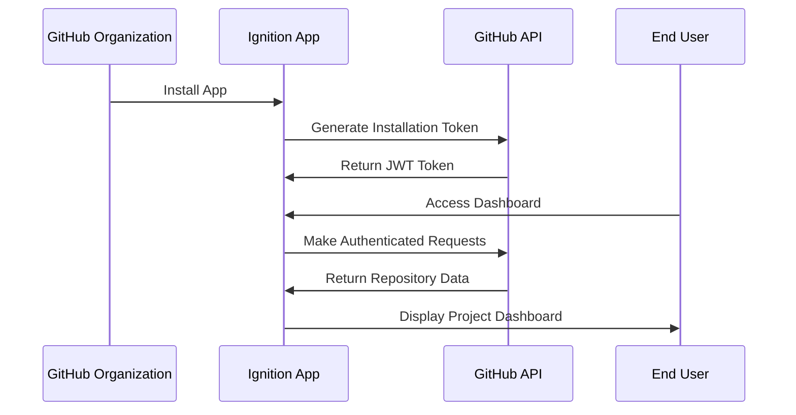

# Ignition GitHub App Architecture

## Executive Summary

The Ignition GitHub App represents a strategic pivot from Personal Access Token (PAT) authentication to enterprise-grade GitHub App architecture. This enables organization-wide installation, enhanced security, granular permissions, and comprehensive compliance audit trails for meta-project management.

## Architecture Overview

### Core Principles
- **Organization-First Design**: Deploy at GitHub organization level as root project manager
- **Enterprise Security**: App-level authentication with fine-grained permissions
- **Compliance-Ready**: Built-in audit trails and regulatory compliance features
- **Scalable Architecture**: Support for multiple organizations and repositories
- **Meta-Management**: Self-managing development process with automated governance

### Strategic Vision
Deploy Ignition as the organizational root project to:
- Manage and monitor all repositories within the organization
- Provide compliance tooling to other teams and external organizations
- Achieve meta-compliance where the tool manages its own development
- Offer enterprise-grade project management as a service

## GitHub App vs OAuth Comparison

| Feature | Personal Access Token | GitHub App |
|---------|----------------------|------------|
| **Scope** | User-level access | Organization-level |
| **Permissions** | Broad, user-defined | Fine-grained, app-specific |
| **Installation** | Manual per repository | Organization-wide |
| **Security** | User credentials | App-level authentication |
| **Audit Trail** | Limited user actions | Comprehensive app actions |
| **Rate Limits** | User-based (5,000/hour) | App-based (15,000/hour) |
| **Enterprise Features** | Limited | Full enterprise support |
| **Compliance** | Manual tracking | Automated audit trails |

## Technical Architecture

### Authentication Flow


### Permission Model
#### Repository Permissions
- **Contents**: Read/Write for project data synchronization
- **Issues**: Read/Write for issue tracking and management
- **Pull Requests**: Read/Write for code review integration
- **Actions**: Read for CI/CD pipeline monitoring
- **Security Events**: Read for vulnerability monitoring
- **Metadata**: Read for repository information

#### Organization Permissions
- **Members**: Read for user management and access control
- **Administration**: Read for organization-level insights
- **Plan**: Read for billing and usage analytics

### Webhook Architecture
#### Event Subscriptions
- **Repository Events**: push, pull_request, issues, release
- **Security Events**: security_advisory, dependabot_alert
- **Organization Events**: member_added, repository_created
- **Installation Events**: installation, installation_repositories

#### Webhook Processing
```typescript
interface WebhookEvent {
  event: string;
  payload: any;
  installation: {
    id: number;
    account: {
      login: string;
      type: 'Organization' | 'User';
    };
  };
}

class WebhookProcessor {
  async processEvent(event: WebhookEvent): Promise<void> {
    switch (event.event) {
      case 'push':
        await this.handleCodeChanges(event);
        break;
      case 'pull_request':
        await this.handlePullRequest(event);
        break;
      case 'security_advisory':
        await this.handleSecurityAlert(event);
        break;
      case 'installation':
        await this.handleInstallation(event);
        break;
    }
  }
}
```

## Security Framework

### Authentication Security
- **JWT Tokens**: Short-lived installation tokens (1 hour expiry)
- **Private Key Management**: Secure storage of GitHub App private key
- **Token Rotation**: Automatic token refresh and rotation
- **Webhook Verification**: HMAC signature verification for all webhooks

### Data Protection
- **Encryption at Rest**: AES-256 encryption for stored project data
- **Encryption in Transit**: TLS 1.3 for all API communications
- **Access Controls**: Role-based access with principle of least privilege
- **Audit Logging**: Comprehensive logging of all app actions

### Compliance Features
- **SOX Compliance**: Financial controls and audit trails
- **GDPR Compliance**: Data privacy and user consent management
- **HIPAA Compliance**: Healthcare data protection (when applicable)
- **FedRAMP**: Federal security requirements (future consideration)

## Installation & Deployment

### GitHub App Registration
```yaml
# GitHub App Configuration
name: "Ignition AI Project Dashboard"
description: "Enterprise-grade meta-compliance project management"
homepage_url: "https://ignition.ai"
callback_url: "https://app.ignition.ai/auth/github/callback"
webhook_url: "https://app.ignition.ai/webhooks/github"
public: true
default_events:
  - push
  - pull_request
  - issues
  - security_advisory
  - installation
default_permissions:
  contents: read
  issues: write
  pull_requests: write
  security_events: read
  metadata: read
```

### Organization Installation
1. **App Discovery**: Organizations find Ignition in GitHub Marketplace
2. **Permission Review**: Administrators review requested permissions
3. **Installation**: Install app with selected repository access
4. **Configuration**: Configure Ignition settings and compliance standards
5. **Activation**: Begin monitoring and managing repositories

### Multi-Tenant Architecture
```typescript
interface Installation {
  id: number;
  organizationId: string;
  repositoryIds: string[];
  settings: {
    complianceStandards: string[];
    auditLevel: 'basic' | 'enhanced' | 'enterprise';
    notifications: NotificationSettings;
  };
  subscription: {
    plan: 'free' | 'pro' | 'enterprise';
    features: string[];
  };
}

class InstallationManager {
  async getInstallation(installationId: number): Promise<Installation> {
    // Retrieve installation configuration
  }
  
  async updateSettings(installationId: number, settings: Partial<Installation['settings']>): Promise<void> {
    // Update installation settings
  }
}
```

## Enterprise Features

### Organization-Wide Dashboard
- **Multi-Repository Overview**: Aggregate view of all organization repositories
- **Compliance Scorecard**: Organization-level compliance assessment
- **Resource Utilization**: Development resource allocation and optimization
- **Risk Management**: Enterprise-wide risk assessment and mitigation
- **Performance Analytics**: Organization-wide development metrics

### Advanced Security
- **Security Posture Management**: Continuous security assessment across all repositories
- **Vulnerability Aggregation**: Centralized vulnerability management
- **Policy Enforcement**: Automated enforcement of security and compliance policies
- **Incident Response**: Coordinated response to security incidents
- **Compliance Reporting**: Automated generation of compliance reports

### Integration Capabilities
- **SSO Integration**: Single sign-on with enterprise identity providers
- **SIEM Integration**: Security information and event management
- **Project Management**: Integration with Jira, Azure DevOps, etc.
- **Communication**: Slack, Microsoft Teams integration
- **CI/CD Platforms**: Jenkins, GitLab CI, Azure Pipelines

## Pricing & Monetization

### Subscription Tiers
#### Free Tier
- Up to 5 repositories
- Basic compliance assessment
- Standard support
- Community features

#### Professional Tier ($29/month per organization)
- Unlimited repositories
- Advanced compliance standards
- Priority support
- Advanced analytics

#### Enterprise Tier ($99/month per organization)
- All Professional features
- Custom compliance frameworks
- Dedicated support
- On-premises deployment option
- Advanced security features

### Revenue Model
- **SaaS Subscriptions**: Monthly/annual subscription revenue
- **Professional Services**: Implementation and consulting services
- **Marketplace Commission**: Revenue sharing with GitHub Marketplace
- **Enterprise Licensing**: Custom licensing for large organizations

## Implementation Roadmap

### Phase 1: Core App Development (4-6 weeks)
- GitHub App registration and basic authentication
- Webhook processing infrastructure
- Multi-tenant data architecture
- Basic dashboard functionality

### Phase 2: Enterprise Features (6-8 weeks)
- Organization-wide repository management
- Advanced security monitoring
- Compliance framework integration
- SSO and enterprise authentication

### Phase 3: Marketplace Launch (2-4 weeks)
- GitHub Marketplace listing
- Documentation and onboarding
- Pricing and billing integration
- Customer support infrastructure

### Phase 4: Advanced Features (8-12 weeks)
- Custom compliance frameworks
- Advanced analytics and reporting
- Third-party integrations
- On-premises deployment options

## Success Metrics

### Technical Metrics
- **Installation Rate**: Number of organizations installing the app
- **Repository Coverage**: Percentage of repositories under management
- **API Performance**: Response times and error rates
- **Security Incidents**: Number and severity of security events

### Business Metrics
- **Monthly Recurring Revenue (MRR)**: Subscription revenue growth
- **Customer Acquisition Cost (CAC)**: Cost to acquire new customers
- **Customer Lifetime Value (CLV)**: Long-term customer value
- **Net Promoter Score (NPS)**: Customer satisfaction and advocacy

---

*This architecture document provides the foundation for transforming Ignition into an enterprise-grade GitHub App for organizational project management and compliance.*
