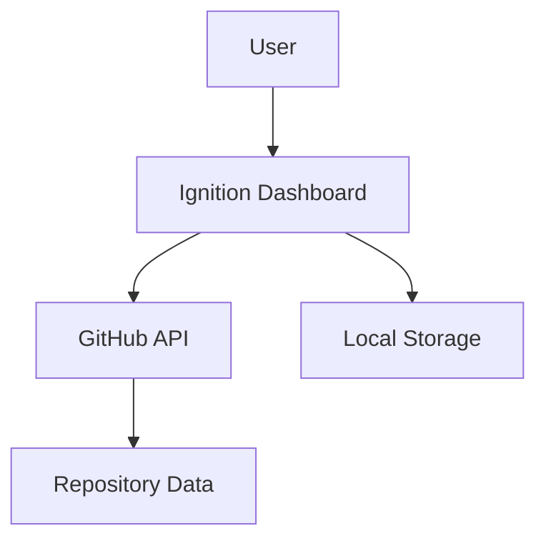
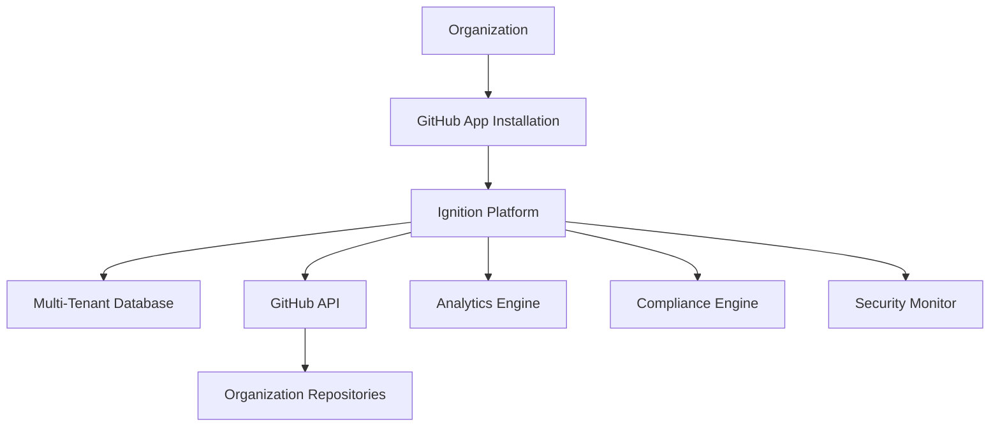

# Ignition GitHub App - Implementation Plan

## Executive Summary

This implementation plan outlines the detailed roadmap for transforming Ignition from a PAT-based system to an enterprise-grade GitHub App. The plan includes authentication flows, installation processes, organizational management features, and deployment strategies.

## Implementation Phases

### Phase 1: Foundation & Authentication (Weeks 1-4)

#### Week 1: GitHub App Setup & Registration
**Objectives:**
- Register GitHub App with proper permissions
- Set up development environment
- Create basic authentication infrastructure

**Deliverables:**
- [ ] GitHub App registered and configured
- [ ] Private key generation and secure storage
- [ ] Basic JWT token generation for app authentication
- [ ] Webhook endpoint infrastructure

**Technical Tasks:**
```typescript
// 1.1 GitHub App Authentication Service
class GitHubAppAuth {
  private privateKey: string;
  private appId: string;

  async generateJWT(): Promise<string> {
    // Generate JWT for app authentication
  }

  async getInstallationToken(installationId: number): Promise<string> {
    // Exchange JWT for installation access token
  }
}

// 1.2 Webhook Handler Infrastructure
class WebhookHandler {
  async verifySignature(payload: string, signature: string): Promise<boolean> {
    // Verify webhook signature using app secret
  }

  async processWebhook(event: WebhookEvent): Promise<void> {
    // Route webhook events to appropriate processors
  }
}
```

#### Week 2: Installation Flow
**Objectives:**
- Implement GitHub App installation process
- Create installation management system
- Set up multi-tenant data architecture

**Deliverables:**
- [ ] Installation callback handling
- [ ] Installation data persistence
- [ ] Multi-tenant database schema
- [ ] Basic installation dashboard

**Technical Tasks:**
```typescript
// 2.1 Installation Manager
class InstallationManager {
  async handleInstallation(installation: Installation): Promise<void> {
    // Process new app installation
    await this.createTenant(installation);
    await this.initializeSettings(installation);
  }

  async handleUninstallation(installation: Installation): Promise<void> {
    // Clean up installation data
    await this.archiveTenant(installation);
  }
}

// 2.2 Multi-Tenant Data Layer
class TenantManager {
  async createTenant(installation: Installation): Promise<Tenant> {
    // Create isolated tenant environment
  }

  async getTenantContext(installationId: number): Promise<TenantContext> {
    // Retrieve tenant-specific context
  }
}
```

#### Week 3: Repository Access & Synchronization
**Objectives:**
- Implement repository discovery and access
- Create data synchronization mechanisms
- Set up real-time webhook processing

**Deliverables:**
- [ ] Repository enumeration and access
- [ ] Project data synchronization
- [ ] Real-time webhook event processing
- [ ] Conflict resolution mechanisms

#### Week 4: Basic Dashboard Integration
**Objectives:**
- Integrate GitHub App auth with existing dashboard
- Migrate core features from PAT to App authentication
- Implement installation-aware UI

**Deliverables:**
- [ ] Updated authentication flow in UI
- [ ] Installation selection interface
- [ ] Migrated core dashboard features
- [ ] Basic error handling and user feedback

### Phase 2: Enterprise Features (Weeks 5-10)

#### Week 5-6: Organization-Wide Management
**Objectives:**
- Implement organization-level dashboard
- Create multi-repository oversight
- Develop aggregated analytics

**Deliverables:**
- [ ] Organization dashboard component
- [ ] Multi-repository data aggregation
- [ ] Organization-level compliance scoring
- [ ] Resource utilization analytics

**Technical Tasks:**
```typescript
// Organization Dashboard Service
class OrganizationService {
  async getOrganizationOverview(installationId: number): Promise<OrganizationOverview> {
    const repositories = await this.getRepositories(installationId);
    const compliance = await this.aggregateCompliance(repositories);
    const security = await this.aggregateSecurityPosture(repositories);
    
    return {
      repositories,
      compliance,
      security,
      analytics: await this.calculateAnalytics(repositories)
    };
  }
}
```

#### Week 7-8: Advanced Security Integration
**Objectives:**
- Implement comprehensive security monitoring
- Create security posture management
- Develop automated policy enforcement

**Deliverables:**
- [ ] Security dashboard for organizations
- [ ] Vulnerability aggregation and reporting
- [ ] Policy enforcement automation
- [ ] Security incident response workflows

#### Week 9-10: Compliance Framework Enhancement
**Objectives:**
- Enhance compliance assessment for organizations
- Implement custom compliance frameworks
- Create automated compliance reporting

**Deliverables:**
- [ ] Organization-level compliance assessment
- [ ] Custom compliance framework support
- [ ] Automated compliance report generation
- [ ] Compliance trend analysis

### Phase 3: Marketplace & Distribution (Weeks 11-14)

#### Week 11-12: GitHub Marketplace Preparation
**Objectives:**
- Prepare app for GitHub Marketplace
- Create comprehensive documentation
- Implement billing and subscription management

**Deliverables:**
- [ ] Marketplace listing preparation
- [ ] Comprehensive app documentation
- [ ] Billing integration (Stripe/GitHub)
- [ ] Subscription tier management

**Technical Tasks:**
```typescript
// Subscription Management
class SubscriptionService {
  async handleSubscriptionChange(installation: Installation, plan: SubscriptionPlan): Promise<void> {
    await this.updateTenantLimits(installation, plan);
    await this.enableFeatures(installation, plan.features);
  }

  async checkFeatureAccess(installation: Installation, feature: string): Promise<boolean> {
    const subscription = await this.getSubscription(installation);
    return subscription.features.includes(feature);
  }
}
```

#### Week 13-14: Launch & Onboarding
**Objectives:**
- Launch app on GitHub Marketplace
- Implement user onboarding flows
- Set up customer support infrastructure

**Deliverables:**
- [ ] GitHub Marketplace listing live
- [ ] User onboarding tutorial
- [ ] Customer support system
- [ ] Analytics and monitoring dashboard

### Phase 4: Advanced Features & Optimization (Weeks 15-20)

#### Week 15-16: Advanced Analytics & Reporting
**Objectives:**
- Implement advanced analytics capabilities
- Create custom reporting features
- Develop predictive analytics

**Deliverables:**
- [ ] Advanced analytics dashboard
- [ ] Custom report builder
- [ ] Predictive analytics models
- [ ] Data export capabilities

#### Week 17-18: Third-Party Integrations
**Objectives:**
- Implement SSO integration
- Create third-party service integrations
- Develop API for external systems

**Deliverables:**
- [ ] SSO integration (SAML, OIDC)
- [ ] Slack/Teams integration
- [ ] Jira/Azure DevOps integration
- [ ] Public API for external integrations

#### Week 19-20: Performance & Scalability
**Objectives:**
- Optimize performance for large organizations
- Implement caching and optimization
- Prepare for enterprise scale

**Deliverables:**
- [ ] Performance optimization
- [ ] Caching layer implementation
- [ ] Database optimization
- [ ] Load testing and capacity planning

## Technical Architecture Changes

### Current vs Target Architecture

#### Current (PAT-based)


#### Target (GitHub App)


### Database Schema Evolution

#### Installation Management
```sql
-- Installations table
CREATE TABLE installations (
    id BIGINT PRIMARY KEY,
    account_login VARCHAR(255) NOT NULL,
    account_type VARCHAR(50) NOT NULL,
    target_id BIGINT NOT NULL,
    permissions JSONB,
    events TEXT[],
    created_at TIMESTAMP DEFAULT NOW(),
    updated_at TIMESTAMP DEFAULT NOW(),
    suspended_at TIMESTAMP,
    settings JSONB DEFAULT '{}'
);

-- Repositories table
CREATE TABLE repositories (
    id BIGINT PRIMARY KEY,
    installation_id BIGINT REFERENCES installations(id),
    name VARCHAR(255) NOT NULL,
    full_name VARCHAR(255) NOT NULL,
    owner_login VARCHAR(255) NOT NULL,
    private BOOLEAN DEFAULT false,
    language VARCHAR(100),
    default_branch VARCHAR(255),
    created_at TIMESTAMP DEFAULT NOW(),
    updated_at TIMESTAMP DEFAULT NOW()
);

-- Project data table (tenant-isolated)
CREATE TABLE project_data (
    id UUID PRIMARY KEY DEFAULT gen_random_uuid(),
    installation_id BIGINT REFERENCES installations(id),
    repository_id BIGINT REFERENCES repositories(id),
    data JSONB NOT NULL,
    version INTEGER DEFAULT 1,
    created_at TIMESTAMP DEFAULT NOW(),
    updated_at TIMESTAMP DEFAULT NOW()
);
```

### API Endpoint Migration

#### Authentication Endpoints
```typescript
// Old PAT-based
POST /api/auth/github
{
  "pat": "ghp_...",
  "repoUrl": "https://github.com/org/repo"
}

// New App-based
POST /api/auth/github/app
{
  "installation_id": 12345,
  "code": "auth_code_from_github"
}
```

#### Data Access Endpoints
```typescript
// Old single-repository
GET /api/project/{projectId}

// New multi-repository
GET /api/installations/{installationId}/repositories
GET /api/installations/{installationId}/repositories/{repoId}/project
GET /api/installations/{installationId}/dashboard
```

## Migration Strategy

### Backward Compatibility
1. **Dual Authentication Support**: Support both PAT and GitHub App authentication during transition
2. **Data Migration Tools**: Automated tools to migrate existing PAT-based projects
3. **Feature Parity**: Ensure all existing features work with GitHub App authentication
4. **Gradual Rollout**: Phased rollout to existing users

### Migration Process
```typescript
class MigrationService {
  async migratePATToApp(patConfig: PATConfig, installation: Installation): Promise<void> {
    // 1. Validate PAT access to repositories
    const repositories = await this.validatePATAccess(patConfig);
    
    // 2. Create installation mapping
    await this.createInstallationMapping(installation, repositories);
    
    // 3. Migrate project data
    for (const repo of repositories) {
      await this.migrateProjectData(patConfig, installation, repo);
    }
    
    // 4. Update user preferences
    await this.updateUserPreferences(patConfig.userId, installation);
  }
}
```

## Risk Mitigation

### Technical Risks
1. **Rate Limiting**: Implement intelligent rate limiting and request queuing
2. **Data Migration**: Comprehensive testing of data migration processes
3. **Performance**: Load testing with large organizations
4. **Security**: Security audit of authentication and data handling

### Business Risks
1. **User Adoption**: Gradual migration with extensive user communication
2. **Marketplace Competition**: Unique value proposition and feature differentiation
3. **Pricing Strategy**: Competitive analysis and value-based pricing
4. **Support Scaling**: Automated support and comprehensive documentation

## Success Metrics

### Technical KPIs
- **Installation Rate**: Target 100 installations in first month
- **API Performance**: <200ms average response time
- **Uptime**: 99.9% availability
- **Error Rate**: <0.1% error rate

### Business KPIs
- **Monthly Recurring Revenue**: $10k MRR by month 6
- **Customer Acquisition Cost**: <$100 CAC
- **Customer Lifetime Value**: >$1000 CLV
- **Net Promoter Score**: >50 NPS

### User Experience KPIs
- **Onboarding Completion**: >80% completion rate
- **Feature Adoption**: >60% of users using advanced features
- **Support Tickets**: <5% of users requiring support
- **User Retention**: >90% monthly retention

---

*This implementation plan provides a comprehensive roadmap for transforming Ignition into an enterprise-grade GitHub App with organizational management capabilities.*
